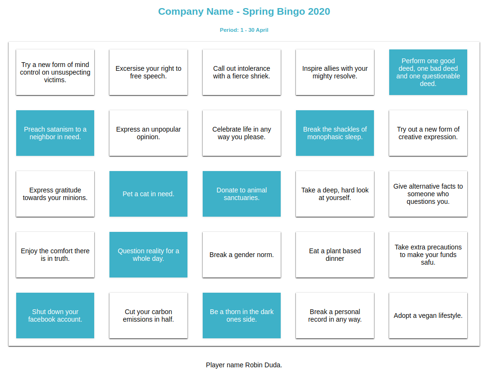

# webcomponents-bingo

The bingo app is a SPA which only uses web standards such as web components and local storage. It's 2019 and there's no need for frameworks, wow.



##### How to play

1. deploy the bingo app
2. notify employees
3. wait for bingo to commence.
4. end of period, collect results.
    4a) either online submission or printed cards.

# Deploy

The application can be run locally in the browser without the need of any server. If you do want a server aiohttp is recommended, it's 8 lines of code to setup a server with async io in Python 3.6.3+.

There is a Dockerfile that can be built, which includes aiohttp.

```console
docker build -t ida-bingo .
docker run -d -p 2019:8080 ida-bingo
```

budget variant, not for production use.
```console
python3 -m http.server
```

The server will then be started on localhost:2019. If the server name changes or the index.html file is moved (when run from disk) then any user data will be lost. Additionally if a domain changes ownership, any data that is locked up in local storage will be available to anything running on the domain by the new owner.
